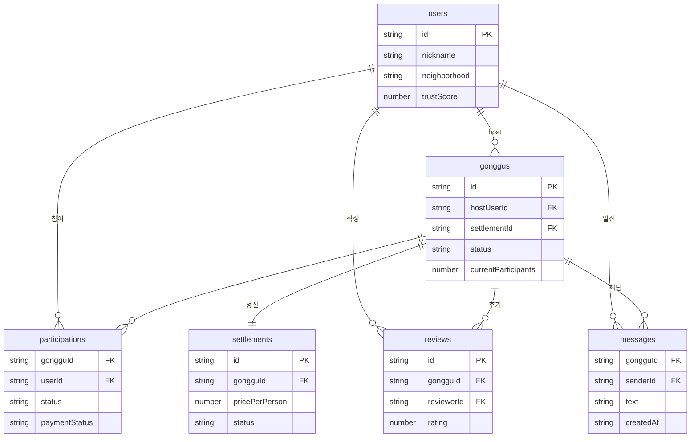

# React Native Architecture

## Decision

The POC uses React Native, Expo, and TypeScript so development can continue in VSCode without Android Studio.

## Layers

- `src/shell`: app shell and navigation state
- `src/entities`: future domain-specific entity modules
- `src/features`: future screen-level feature modules
- `src/services/mock`: in-memory POC repository
- `src/services/firebase`: Firebase adapter boundary
- `src/shared`: design tokens, UI helpers, formatters
- `src/types`: shared domain types

## 데이터 모델 (Firestore)

Firestore(문서 DB) 기준 데이터 모델이다. 관계형 외래키 제약은 없고 **문서 id를 필드로 저장해 참조**한다(아래 `FK`). 채팅 `messages`는 `chats/{gongguId}/messages` 서브컬렉션이다.



> NoSQL 설계상 일부 값은 의도적으로 비정규화되어 있다(예: `gonggus`에 `hostNickname`/`hostTrustScore` 복제 저장 → 리스트 조회 1회로 빠르게 표시).

## Current Flow

```text
mock login
  -> location verification mock
  -> home list/map placeholder
  -> gonggu detail
  -> join gonggu
  -> chat
  -> settlement state
  -> pickup confirmation
  -> required review
  -> settlement releasable
```

## Firebase Boundary

Client reads can use Firestore directly where safe. Mutations that affect trusted state should go through Cloud Functions:

- join/cancel participation
- recruitment status changes
- pickup confirmation
- review submission and trust score updates
- settlement/payment/payout state changes
