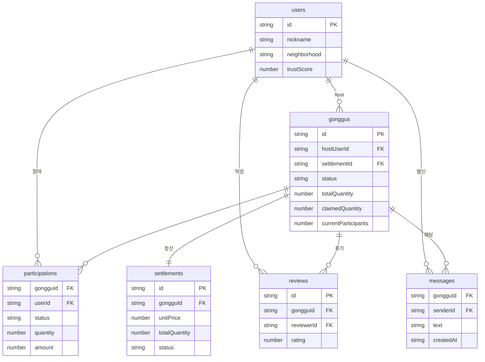

# React Native Architecture

## Decision

The POC uses React Native, Expo, and TypeScript so development can continue in VSCode without Android Studio.

## Layers

- `src/shell`: app shell and navigation state
- `src/entities`: future domain-specific entity modules
- `src/features`: future screen-level feature modules
- `src/services/mock`: in-memory POC repository
- `src/services/firebase`: Firebase adapter boundary
- `src/shared`: design tokens, UI helpers, formatters
- `src/types`: shared domain types

## 데이터 모델 (Firestore)

Firestore(문서 DB) 기준 데이터 모델이다. 관계형 외래키 제약은 없고 **문서 id를 필드로 저장해 참조**한다(아래 `FK`). 채팅 `messages`는 `chats/{gongguId}/messages` 서브컬렉션이다.



> NoSQL 설계상 일부 값은 의도적으로 비정규화되어 있다(예: `gonggus`에 `hostNickname`/`hostTrustScore` 복제 저장 → 리스트 조회 1회로 빠르게 표시).

### 데이터 모델 기준 (MVP)

**수량 기반 공동구매**가 단일 기준이다. 앱·시드·Functions·문서 모두 아래 필드명을 쓴다:

- `Gonggu.totalQuantity` / `Gonggu.claimedQuantity` / `Gonggu.currentParticipants`
- `Settlement.unitPrice`(= `ceil(totalPrice / totalQuantity)`) / `Settlement.totalQuantity`
- `Participation.quantity` / `Participation.amount`(= `unitPrice × quantity`)

참여 문서는 **top-level `participations` 컬렉션**에 저장한다. 문서 id 규칙은 `` `${gongguId}__${userId}` `` (공구×사용자 1:1). `gonggus/{id}/participants` 서브컬렉션은 **사용하지 않는다**.

과거 `targetParticipants` / `pricePerPerson` / `participantCount` 필드는 폐기됨.

## Current Flow

```text
mock login
  -> location verification mock
  -> home list/map placeholder
  -> gonggu detail
  -> join gonggu
  -> chat
  -> settlement state
  -> pickup confirmation
  -> required review
  -> settlement releasable
```

## Firebase Boundary

**MVP 현황 (POC):** 클라이언트가 Firestore를 직접 읽고(`onSnapshot` 실시간 구독), **쓰기도 클라이언트에서 직접** 수행한다(`src/services/firebase/*Repository.ts`). Firestore Rules는 이를 허용하도록 완화된 POC 규칙이다.

**활성 Cloud Functions:** 푸시 알림만 실제 사용된다.
- `onNewChatMessage`(트리거) / `onDeadlineApproaching`(스케줄) → top-level `participations` 기준으로 수신자 조회 후 FCM 발송.

**Phase 2 예정 (authoritative mutation, 현재 미연동):** `joinGonggu` / `confirmPickup` / `submitReview` 콜러블은 앱과 동일한 수량 모델·`participations` 컬렉션으로 맞춰 두었으나, MVP 클라이언트는 아직 호출하지 않는다. 실서비스 전환 시 아래를 Functions로 이관하고 Rules를 다시 조인다:

- join/cancel participation, 모집 상태 전환
- pickup confirmation, 후기 제출 + 신뢰도 갱신
- settlement/payment/payout 상태 변경
